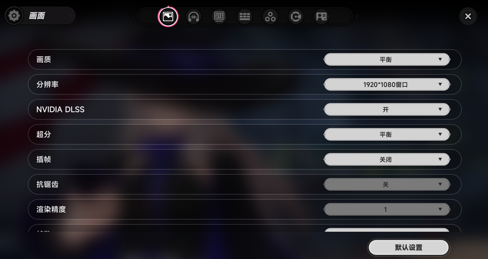

<!-- markdownlint-disable MD028 MD029 MD033 MD041 -->

  

  <h1 align="center">BetterNTE</h1>

  

     
    A computer-vision-based automation tool for <i>Neverness to Everness</i>
       
      Built from scratch with Rust
  

  

    
    
    
    
     
    
    
    
  

> **[English](README_EN.md)** | [简体中文](README.md)

> 💡 This project is still in early development and may have bugs and rough edges. If you encounter any issues or have suggestions, feel free to submit an [Issue](https://github.com/BetterAutoFramework/BetterNTE/issues) or join the discussion on QQ group 1102341902.

> ⚠️ Please download the software from the official [Releases](https://github.com/BetterAutoFramework/BetterNTE/releases) page. Software obtained through unofficial channels may **contain malware** and is usually outdated.

## Features

- **Vision Engine**: Screenshots (multiple backends), template matching, OCR, object detection, image classification
- **Input Simulation**: Keyboard & mouse automation
- **Script System**: Hot-reloadable JavaScript scripts, `ctx` API for engine capabilities, manifest-based declarative configuration
- **Desktop Client**: Polished UI built with Tauri, supports script execution, flow orchestration, and log viewing

## Download

- [GitHub Releases](https://github.com/BetterAutoFramework/BetterNTE/releases)
- [Quark Cloud Drive](https://pan.quark.cn/s/be7f6bcea757)

## Requirements

- Windows 10 or later (64-bit)

> 📌 The game must be running in `1920x1080` windowed mode.
>
> 

>   
>   
Main Interface

> 

## FAQ

- **Why does it require administrator privileges?**
  Because games usually run with admin rights, the tool needs the same privilege level to simulate input.

- **What resolutions are supported?**
  `1920x1080` windowed mode is recommended. Currently only `16:9` aspect ratios are supported.

- **Something went wrong, what should I do?**
  Check the [Issues](https://github.com/BetterAutoFramework/BetterNTE/issues) page first. If no solution is found, feel free to open a new issue.

## Documentation

| Document | Description |
|----------|-------------|
| [Development Guide](docs/development_EN.md) | Environment setup, project structure, build & debug |
| [Scripting Guide](docs/scripting-guide_EN.md) | manifest, `ctx` API, triggers, Flow definitions |

## ⚠️ Disclaimer

BetterNTE is an open-source, free automation tool intended for learning and personal use only.

- **How it works**: Uses computer vision to recognize and interact with the game UI. It does not modify any game files, memory, or network data.
- **Purpose**: Provides operational convenience for players. It does not disrupt game balance or provide unfair advantages.
- **Use at your own risk**: Users are solely responsible for any consequences arising from the use of this tool, including but not limited to account penalties. The project and its developers are not liable for any damages.
- **Commercial use**: Any third-party use of this software for boosting, paid services, or other commercial purposes is unrelated to this project.

> **Note:** Per the [Erta Ring Fair Play Policy](https://yh.wanmei.com/news/gamebroad/20260202/260701.html), the use of any third-party tools to compromise game fairness is strictly prohibited. Violators may face deduction of rewards, account suspension, or permanent bans.
>
> By using this tool, you acknowledge that you fully understand the risks involved and accept all consequences.

## Acknowledgements

This project would not be possible without:

- [Tauri](https://tauri.app/) — Cross-platform desktop application framework
- [QuickJS](https://bellard.org/quickjs/) (via `rquickjs`) — Embedded JavaScript runtime
- [opencv-rust](https://github.com/twistedfall/opencv-rust) — OpenCV Rust bindings for image recognition
- [better-genshin-impact](https://github.com/babalae/better-genshin-impact) — Architecture design and implementation references
- [MaaFramework](https://github.com/MaaXYZ/MaaFramework) — Architecture design and implementation references
- [MaaNTE](https://github.com/1bananachicken/MaaNTE) — Task flow implementation references

### Contributors

Thanks to all developers who contributed to testing and development!

## License

[GPL-v3 License](LICENSE)

---

If you find this project helpful, please give us a Star (the star button at the top right of the page) — that's the biggest support for us!
